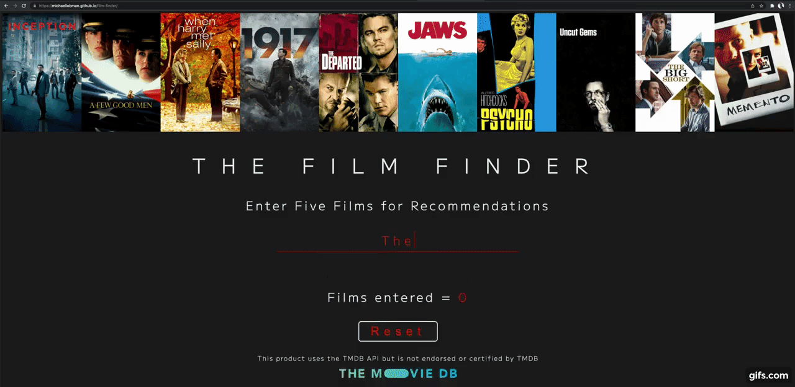

# The Film Finder

The Film Finder is a Single-Page Application for finding film recommendations.

## Description

In today's age of streaming, it can be difficult to sort through the myriad options at our fingertips to find something to watch. That is where The Film Finder comes in. It asks you to enter **5** films, from which it will generate **10** unique recommendations based on the keywords, genre preferences, time period, and personnel of the entered films.

## Usage

Begin by typing your first film into the input form. As you type, the top search results from The Movie Database's API will populate beneath the text area in the form of their repective posters. When your intended film appears, click on its poster to confirm that recommendation.

Repeat this process until you have entered **5** films, at which time the "Get Recommendations" will appear.

Click the "Get Recommendations" button to generate your **10** recommended films.

*Do you like similar movies?* Have no fear! The Film Finder will neither repeat an entry as a recommedation nor will it provide duplicate recommendations. For example, if you enter **5** *Harry Potter* films, your **10** recommendations will include the other **3** films in the series but will not regurgitate your entries. 

## Support

If you have any questions, issues, or just want to chat, you can email me *michael.lobman@gmail.com*. 

## License

The Film Finder uses the TMDB API but is not endorsed or certified by TMDB.